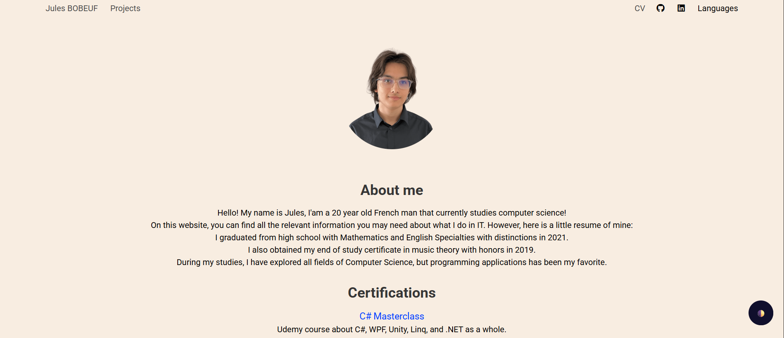

<div align="center">
  <h1 align="center">Old Portfolio</h1>
    <p align="center">
    My old portfolio, Built using Hugo, HTML, CSS & JavaScript.
</div>

## About The Project

This project was created as a personal portfolio website using Hugo. It highlights my projects, experience, and contact details. This portfolio was made during my first year at university and has been updated for 2 years afterwards.

## Built With

[](https://gohugo.io/)  
[](https://developer.mozilla.org/en-US/docs/Web/HTML)  
[](https://developer.mozilla.org/en-US/docs/Web/CSS)  
[](https://developer.mozilla.org/en-US/docs/Web/JavaScript)

## Getting Started

### Folder Structure

```markdown
old-portfolio/
├── 📁 content/      # Markdown content files for pages
├── 📁 layouts/      # Hugo templates and page layouts
├── 📁 static/       # Static files served as-is
├── 📄 config.toml   # Hugo site configuration
└── 📄 README.md     # Project documentation
```

### Prerequisites

Make sure you have the following installed:

```sh
Hugo >= 0.112.0
A modern web browser (Chrome, Firefox, Edge, etc.)
```

### Installation

1. Download and install Hugo:  
   [https://gohugo.io/getting-started/installing/](https://gohugo.io/getting-started/installing/)

2. Clone the repository:

   ```sh
   git clone https://github.com/JulesBobeuf/old-portfolio.git
   ```

3. Navigate into the project directory:

   ```sh
   cd old-portfolio
   ```

4. Start the Hugo development server:

   ```sh
   hugo server
   ```

5. Open your browser and go to `http://localhost:1313` to view the site locally.

## Usage

Navigate through the site locally via the Hugo server. Explore the pages to see the projects, about section, and contact information.

## License

This project is licensed under the MIT License. See the [LICENSE](LICENSE) file for details.

## Contact

Jules Bobeuf  
[LinkedIn](https://www.linkedin.com/in/bobeuf-jules/)  
bobeuf.jules@gmail.com
